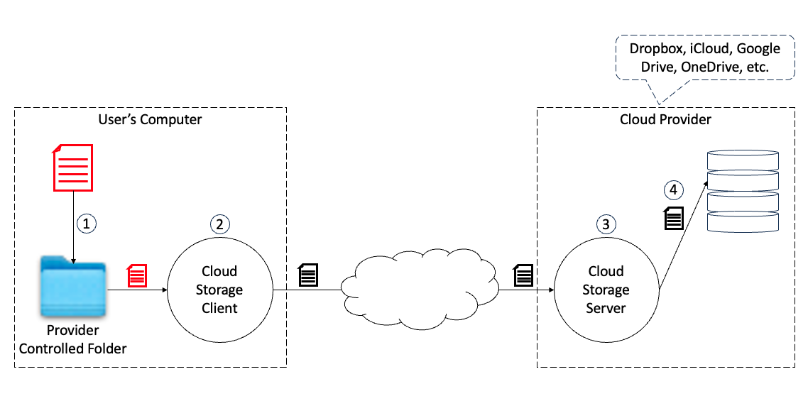
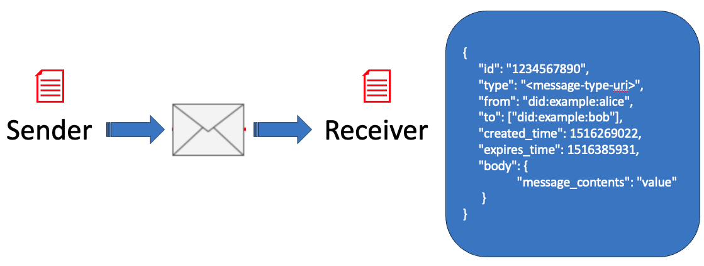
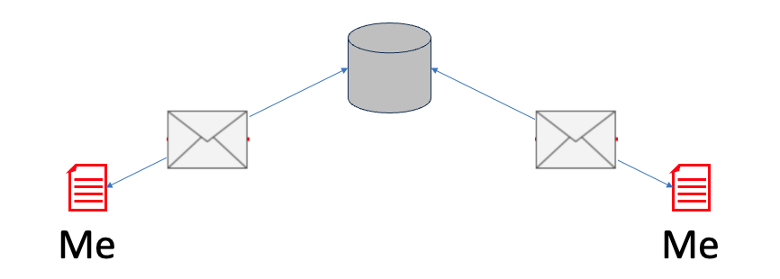
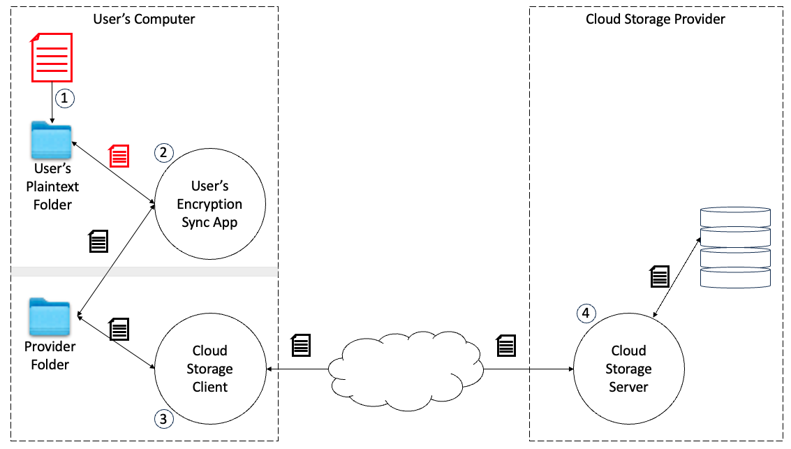
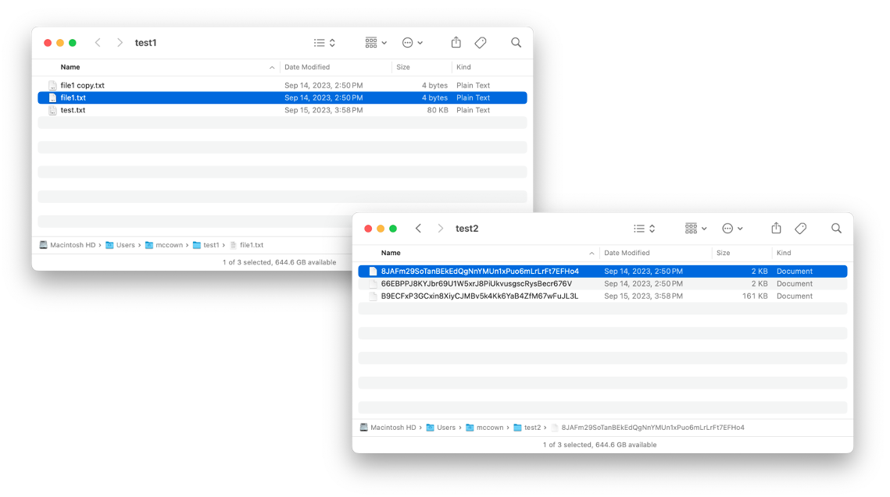

# Protecting Cloud Storage
<p style="text-indent: 25px;">*Layering E2E encryption on cloud storage services ... or ... using DIDComm with just one peer.*
<BR>
<BR>
## Background
Cloud-based storage platforms, such as [Dropbox](https://www.dropbox.com), Apple’s [iCloud](https://www.icloud.com/), Google’s [Drive](https://www.google.com/drive/), and Microsoft’s [OneDrive](https://www.microsoft.com/en-us/microsoft-365/onedrive/online-cloud-storage) all provide amazing file storage and retrieval capabilities.  They protect a user’s files against loss, enable file sharing with other users, and let users synchronize files between their many devices.  However, it is unclear how they protect a user's data within their server environments, which is emphasized by a number of notable data breaches that have occurred over the years [1](https://www.darkreading.com/vulnerabilities-threats/dropbox-files-left-unprotected-open-to-all), [2](https://www.vice.com/en/article/nz74qb/hackers-stole-over-60-million-dropbox-accounts), [3](https://www.infosecurity-magazine.com/news/dropbox-breach-130-github/).

Some questions worth asking include:  *Do the server processes mine the information content of the data while providing storage services?*  *Are the data sufficiently protected against disclosure or compromise by hackers, software flaws, or other inadvertent disclosure?*  The answers to these questions are unclear and may vary over time.

The purpose of this tutorial is to demonstrate how individual users can (independent of their chosen cloud storage provider or service) protect the files that they store in cloud storage environments using the end-to-end encryption capabilities of *Decentralized Identity* and the [*DIDComm Communication protocol*](https://didcomm.org).  

Most contemporary cloud storage providers have implemented a similar client-server architecture whereby a locally-installed *Cloud Storage Client* monitors a designated file folder on user's computer(s) for changes.  When changes are detected, they are replicated up to the user's account on the cloud provider's server.  From there, the changes are replicated to the user's other devices.  Here's an overview of how this process works:


<center>Figure 1 - Cloud Storage Overview</center>

While in-depth knowledge of particular tools is not required for this tutorial, it is helpful if readers a cursory awareness of Decentralized Identity, including [Decentralized Identifiers](https://www.w3.org/TR/did-core/), [Verifiable Credentials](https://www.w3.org/TR/vc-data-model-2.0/), [Digital Wallets](https://openwallet.foundation), etc.  

<BR>
## Motivations
Leading up to this tutorial, I had a few motivating questions:

1. Can users layer End-to-End Encryption (E2EE) on cloud storage services completely independent of any proprietary API?
2. Can users select their own cryptographic processes and hold their own keys (without *'help'* from the service provider)?
3. Can users add the E2EE for free?
4. How will adding E2EE as presented below change the cloud storage service experience?

The answer to the first 3 questions is "Absolutely!"  With question #4, there are some tradeoffs to be considered and that will take some discussion, which I will leave that to the end.

<BR>
## Tutorial Exclusions

The purpose of this tutorial is to show how cloud storage services can be protected by adding additional (described below) synchronization and cryptographic processes.  While encryption key management and key storage wallets are <u>critical</u> in deployment scenarios, they are *beyond the scope of this tutorial* ... at least at this time.  With that in mind, you will notice that I am intentionally using obviously weak keys (e.g., "000...") and the same DID for everything.  While I'm hoping that you will find this tutorial insightful and choose to extend it, please don't deploy it on live data in its current state.  *You have been warned.  :-)*


<BR>
## Super Quick Intro to DIDComm
According to the [DIDComm Spec](https://identity.foundation/didcomm-messaging/spec/v2.0/), *"The purpose of DIDComm Messaging is to provide a secure, private communication methodology built atop the decentralized design of [DIDs](https://www.w3.org/TR/did-core/)."*. At a high level, DIDComm describes a JSON formatted message that can be transmitted from the sender to the receiver:


<center>Figure 2 - DIDComm Messaging Overview</center>

When E2E encrypted, the DIDComm message format keeps only the essential delivery information in plaintext with everything else (e.g., body, attachments) encrypted from the recipient to the sender.  For simplicity and versatility, the DIDComm message format will be used to encrypt files as they are prepared to be synchronized from a local folder to the cloud storage service.

<BR>
## Internet Communications:  *Store and Forward*
Communications on the internet are largely based on the *store & forward* paradigm.  In this paradigm, when messages are routed from sender to receiver, they are often stored on a mediator along the way before they are subsequently forwarded to the recipient.  This tutorial implements a variation of this paradigm which will *store (for an arbitrarily long time) and forwards (later)*.


<center>Figure 3 - Store and Forward with Indefinite Storage</center>

<BR>
## Extending the Cloud Storage Synchronization Method
In contemporary cloud storage synchronization paradigms, the cloud storage service installs a Cloud Storage Client service on the user's device.  This Cloud Storage Client detects changes in a monitored folder and synchronizes them with the user's cloud storage account on the Cloud Storage Server.  The Cloud Storage Server, in turn, synchronizes those changes with the user's other devices.

The standard cloud storage model is a good one, so I'm going to duplicate it.  In order to perform the encryption / decryption services, a new *User's Encryption Sync App* service will be created (see Figure 4 below).  This service app will operate continuously in the background and monitor for file changes in the cloud service *Provider Folder* and also a new *User's Plaintext Folder*.  

When new or modified files are detected in the User's Plaintext Folder, the corresponding files will be encrypted using DIDComm's cryptographic capabilities (more later) and then copied to the cloud service Provider Folder.  Similarly, when encrypted files are detected in the Provider Folder, they will be decrypted using DIDComm's cryptographic capabilities and then copied into the User's Plaintext Folder.  This encryption / decryption synchronization process will continue as files are created, deleted, or modified.

What's neat about this process is that it operates completely independent of the cloud service provider's architecture or implementation choices, because it relies on the host's file system capabilities instead of the cloud storage provider's API.  This offers a lot of flexibility in the type of encryption that is used and it also makes the encryption transparent to any application reading or writing from the User's Plaintext Folder.  This is also what makes this service easily interchangeable between Dropbox, Apple's iCloud, Google Drive, Microsoft's OneDrive, or any other cloud storage service with a host file system interface.


<center>Figure 4 - Cloud Storage with Userside Synchronization</center>

<BR>
## File Formatting:  Why DIDComm?
As files are encrypted, I chose to use the [DIDComm](https://didcomm.org) messaging format.  Admittedly, this is not the most concise format for storing files and it contains additional (unnecessary?) message routing functionality, so why would I choose it for file storage? 

Firstly, I am a Co-Chair of the [DID Communication](https://identity.foundation/working-groups/did-comm.html) Working Group at the [Decentralized Identity Foundation](https://identity.foundation).  In that capacity, our mission is to create and enhance the [DIDComm Specification](https://identity.foundation/didcomm-messaging/spec/v2.0/).  In one of our meetings, someone made the comment that exploring or extending a messaging protocol in a live setting required developers to first setup non-trivial message routing infrastructure (think: AWS).  Reflecting on that observation, I decided to create a tangential use case where the sender and receiver could be the same individual and that stored files could take the place of transmitted messages.  This allowed some of the protocol's testing to be done in an existing 'live' setting that relied on cloud storage services instead of requiring a messaging infrastructure.  Other innovators in the DIDComm groups have previously used email clients in place of tailored messaging infrastructures, which is also an intriguing use case.

Secondly, I think that there may be some hidden uses cases for which having embedded routing capabilities may be beneficial.  While this is completely beyond the scope of this tutorial, here is one such use case: *survivable encryption*.  Many people like to keep daily journals, document their inventions, record financial account activity, keep cryptographic wallets, etc., but don't want to entrust control of those data stores to an external data storage or management service that often say, "You can trust us, because we have a *privacy policy*..." or "Your data is safe, because *we promise to*...".  

However, even privacy-centric users may want unrestricted access to their digital content to be granted to their heirs, someday.  Since DIDComm inherently facilitates multiple recipients, a user could setup a stored file (i.e., DIDComm message) that is addressed to themselves for their own ongoing usage, but also be addressed to the Decentralized Identifiers of their heirs.  Setting up file storage in this manner would keep the file content hidden from the cloud storage provider, let users continue using their own data, and have the data *pre-addressed* it to their heirs.  The only step required of a cloud storage provider would be to deliver the stored files (i.e., DIDComm encrypted) to the heirs upon presentation of a valid Death Certificate, Last Will and Testament, etc.  Whereas other survivable encryption methods would allow the cloud storage platform providers to have plaintext access to a user's files or access to their encryption keys, this method works with only the user and their heirs being able to access protected content.

There are a number of other use cases that would benefit from DIDComm protected messaging formats, but that's a different discussion.  So, back to the tutorial...

<BR>
## File Formatting:  What does it look like?

DIDComm formatted messages are presented as plaintext JSON formatted structures.  For cryptographic security, DIDComm messages protect their sensitive components using a variety of [elliptic curves and encryption methods](https://identity.foundation/didcomm-messaging/spec/v2.0/#curves-and-content-encryption-algorithms), such as AES256-GCM, AES256-CBC with an HMAC-SHA512, etc.  The elliptic curves currently used include X25519, P-384, P256, and P-521.  As quantum encryption methods are finalized, it is foreseen that those algorithms will be quickly adopted into a future iteration of the formal [DIDComm Messaging](https://identity.foundation/didcomm-messaging/spec/v2.0/) Specification. 

An encrypted DIDComm message looks like this:

	{
		"protected":"eyJ0eXAiOiJhcHBsaWNhdGlvbi9kaWRjb21tLWVuY3J5cHRlZCtqc29uIiwiZW5jIjoiQTI1NkdDTSIsImtpZCI6IldfVmNjN2d1dmlLLWdQTkRCbWV2VnctdUpWYW1RVjVyTU5RR1V3Q3FsSDAiLCJza2lkIjoiZGlkOmtleTp6Nk1raVRCejF5bXVlcEFRNEhFSFlTRjFIOHF1RzVHTFZWUVIzZGpkWDNtRG9vV3AiLCJhbGciOiJFQ0RILTFQVStBMjU2S1cifQ",
		"recipients":[
			{
				"header":{
					"key_ops":[],
					"alg":"ECDH-1PU+A256KW",
					"kid":"did:key:z6MkiTBz1ymuepAQ4HEHYSF1H8quG5GLVVQR3djdX3mDooWp",
					"epk":{
						"kty":"OKP",
						"crv":"X25519",
						"x":"sI4GXfe7pHrZ1I3jhB_UT34Iw5IMvgf8npd2UwLUe1I"
					},
					"tag":"MyYLSqwL-zV5p4KIG6hfaQ",
					"iv":"z77anoWbR0v7Ihec"
				},
				"encrypted_key":"XkWFukZDBuz2Jx82w1uvpM6Pl6T9XJJQg3Bx9x4AV2w"
			}
		],
		"ciphertext":"2Rhl0fvf1frZI_hUhY2-O7ld9sWphf5XCMOY1ebqSmZjff_FyC19FrKoxRAYQueyHn9jwU-u1qC0bTFb17YFu0ViFmx0SsIkL1ntyJlurpxoWs4eqkil2BHrriyW2bC8aUp5vrstenG8gckAA4jq57x_HoL2v8ryhLyvOUkrza2Pk0W0P8afIE99F74A0Feno47aganUD5Jg_OlxC07h4Zkqv-qltyoaf6ot0IadEc7e4AdQUdriEliacxZMMb87vzudFv4-5DrNCTfSdOqP-UqlzyJYjgoJkYD81cGjC-yvTPJVU5_msfOD4n6DXU0JKgPdU0R6KoyTBhiB8Arr_i5kgzaQVcq0roiHEp04gJrYeMH6jHsSPIh7CNCMz3U3KMJ_wFMjSDnKiDLFU3g2SFC2IpWuBrgCfII_KvftFgIMEtXvgd-iX1QT1B6TkGWyhgnZUsmt8FXDrBGuNgRbvPoOZk-ewol0eq5dRI5IoVI9GQU5oxIyImKTcoi00mPqtyWyXc_CfRrJXKRUANUtjefonKeQFtieqh4451e_Fgd10UGPY3ylL82krZtGh-QLqxqXqDMuzvw29hsYOdmYgr8m-dCWcaULW6lLN69QDVOnT4cin1n2Q0QGGnisS__VobkzYVBAHd_30NyvzgXjuCFXmHho9LM-CTjv92JmmZrZFWIFAEsqK5zB24bBfW7A1Ouf7FKo4TfXLr_z17amyDVpxL27U6b4yMbXuPemNUk7-z7km7NS8ffwZcKZko-R4NOlf56RZ1ZELTWhqgrfF_X7FzTpyJj7PzAI9zuNSzliIHRW7qOTdT_CcBFmrXiJGUNrLmI5C74PcctrdVLC93YRhfNVsGWDaKtQbnnXg3WQirVwDpELUludE-aXgeOHSjv7UhvnInEKglsNiCgSs40Kf06ToLDHpi1hwFBFoHwq-Ad5wrD_EOvMTvW8LmFSpru1",
		"iv":"2jBWPDXxzTcFWBVx_jGnTXf8p5ANi4rJ",
		"tag":"6wQn2QSRhnVq4qRUC-dP2Q"
	}
<center>Figure 5 - Sample Encrypted DIDComm Message</center>

The format of the files encrypted using the process described in this tutorial is implemented using the DIDComm message format, such as that illustrated above.

<BR>
### Encrypted File Naming 
Creating a name for an encrypted file is not as simple as encrypting it.  One reason is that, depending on the encryption algorithm, ciphertext lengths are not always the same as the plaintext length.  In some circumstances, this could result in encrypted filename lengths being longer than the maximum allowed by the system.  

In order to avoid these types of situations, ciphertext file names will be encoded as an HMAC256 of the plaintext filename and then will be base58 encoded.  HMAC256 provides sufficient protection and ensures a limited length while the base58 encoding ensures that no special characters are in the resulting name text.

<BR>
### File Management Dilemma 
Using the DIDComm message format greatly simplifies the implementation of extensible encrypted file storage.  When the User's Encryption Sync App (described above in Figure 4), detects file changes in the User's Plaintext Folder, it will handle them like this:

<ol>
<li><B>New File:</B>  the detected file will be encrypted and copied into the Provider Folder.  The name of the encrypted file in the Provider Folder will be an HMAC256 of the plaintext file name that has been base58 encoded.</li> 

<BR>
<li><B>Modified File:</B>  modified files are handled essentially the same as new files with the addition that the existing encrypted file will be overwritten by the newly encrypted file.</li> 

<BR>
<li><B>Deleted File:</B>  when deleting a plaintext file the corresponding encrypted file must be deleted from the Providers Folder.  To do this, the plaintext filename is first encoded as with new files.  The Providers Folder is searched for a file with the encoded name, which is deleted when found.</li> 
</ol>

When the User's Encryption Sync App detects changes in the Provider Folder (i.e., the encrypted files), it will do the following:

<ol>
<li><B>New File:</B>  decrypt the encrypted file and create the corresponding plaintext file in the User's Plaintext Folder.</li> 

<BR>
<li><B>Modified File:</B>  this operates essentially the same as with creating a new file.  The encrypted file is decrypted and the corresponding plaintext file is created in the User's Plaintext Folder.  Any existing plaintext file is overwritten.</li> 

<BR>
<li><B>Deleted File:</B>  When an encrypted file is deleted from the Cloud Storage Provider's cloud, that file delete action is replicated on the user's device resulting in the encrypted file being deleted from the Provider Folder.  By the time that the User's Encryption Sync App detects that an encrypted file has been deleted, it has already been deleted.  This means that the filename cannot be decrypted (using any information contained within the file) to know which corresponding plaintext file to delete.  <i>This situation requires special handling.</i></li> 
</ol>

<BR>
### Adding a New File Header
Handling the case where encrypted files are deleted before their plaintext counterparts (as described above) is best handled with the addition of a new file header that will be placed before the DIDComm message in the encrypted file.

The file header looks like this:

	{
		"encrypted_filename":"Y6MNigbxeQHUbJgjWQWJpv",
		"filename_hmac256":"8JAFm29SoTanBEkEdQgNnYMUn1xPuo6mLrLrFt7EFHo4",
		"key_id":"11111111111111111111111111111111"
	}
	
The file header has 3 members:

<ol>
<li><B>encrypted_filename:</B>  this is an AES256 encryption of the plaintext filename with the encrypted output being base58 encoded.  </li>
<li><B>filename_hmac256:</B>  an HMAC256 computation of the plaintext filename with the output being base58 encoded.</li>
<li><B>key_id:</B>  this is a textual identifier of the AES encryption key that is created and contained within the users digital wallet.</li>
</ol>

This header implements the functionality described above.  It also allows the easy decryption and recognition of the target plaintext file.

<BR>
### Deleting the Plaintext File When the Encrypted File Has Already Been Deleted
When deleting a plaintext file associated with an encrypted file that has already been deleted, it is necessary to search for the plaintext file, since it is not possible to go directly to it.  The algorithm for locating the plaintext file is as follows:

<pre><code>fn plaintext_file_associated_with_encrypted_file(
	encrypted_filename: String,
	source_root: String, 
   	dest_root: String, 
   	key_id: [u8; AES256_KEY_LENGTH]) -> String {

	let mut file_to_delete: String = "".to_string();

	<B>// Scan the plaintext directory.  For now, this only scans the directory.  
	// and not sub-directories.  Eventually, this will scan the entire sub-directory tree.</B>
	let paths = fs::read_dir(dest_root.clone()).unwrap();
	for path in paths {
		if let Ok(p) = path {
				
			<B>// Get a String representation of the path.</B>
			let filepath = p.path().clone().into_os_string().into_string().unwrap();

			<B>// Remove the full path component to get the relative path portion.</B>
			let file_rel_path = filepath.replace(&dest_root, "");

			<B>// Create a hash of the relative file name and create mock-up of a would be encrypted file.
			// This enables the calculated_encrypted_filename to be compared with the actual encrypted_filename that was deleted.</B>
			let hashed_filename = hash_filename(file_rel_path.clone(), key_id.to_base58().clone());
			let calculated_encrypted_filename = source_root.clone() + &std::path::MAIN_SEPARATOR_STR.to_owned() + &hashed_filename;
			if encrypted_filename.to_string() == calculated_encrypted_filename.to_string() {
				file_to_delete = filepath;
				break;
			}
		}
	}
		
	return file_to_delete;
}</code></pre>
<center>Figure 6 - Calculating the plaintext filename associated with an encrypted filename.</center>

The method described above essentially searches for the corresponding plaintext filename by encrypting / base58 encoding it and comparing the encrypted filename that was deleted.  While this method is not as fast as directly decrypting an encrypted filename, however, it handles the case of needing to match a plaintext file to an encrypted file that has already been deleted. 

With pretty printing applied, the full DIDComm encrypted message with the added file header will look as follows:

	{
		"encrypted_filename":"Y6MNigbxeQHUbJgjWQWJpv",
		"filename_hmac256":"8JAFm29SoTanBEkEdQgNnYMUn1xPuo6mLrLrFt7EFHo4",
		"key_id":"11111111111111111111111111111111"
	}
	{
		"protected":"eyJ0eXAiOiJhcHBsaWNhdGlvbi9kaWRjb21tLWVuY3J5cHRlZCtqc29uIiwiZW5jIjoiQTI1NkdDTSIsImtpZCI6IldfVmNjN2d1dmlLLWdQTkRCbWV2VnctdUpWYW1RVjVyTU5RR1V3Q3FsSDAiLCJza2lkIjoiZGlkOmtleTp6Nk1raVRCejF5bXVlcEFRNEhFSFlTRjFIOHF1RzVHTFZWUVIzZGpkWDNtRG9vV3AiLCJhbGciOiJFQ0RILTFQVStBMjU2S1cifQ",
		"recipients":[
			{
				"header":{
					"key_ops":[],
					"alg":"ECDH-1PU+A256KW",
					"kid":"did:key:z6MkiTBz1ymuepAQ4HEHYSF1H8quG5GLVVQR3djdX3mDooWp",
					"epk":{
						"kty":"OKP",
						"crv":"X25519",
						"x":"sI4GXfe7pHrZ1I3jhB_UT34Iw5IMvgf8npd2UwLUe1I"
					},
					"tag":"MyYLSqwL-zV5p4KIG6hfaQ",
					"iv":"z77anoWbR0v7Ihec"
				},
				"encrypted_key":"XkWFukZDBuz2Jx82w1uvpM6Pl6T9XJJQg3Bx9x4AV2w"
			}
		],
		"ciphertext":"2Rhl0fvf1frZI_hUhY2-O7ld9sWphf5XCMOY1ebqSmZjff_FyC19FrKoxRAYQueyHn9jwU-u1qC0bTFb17YFu0ViFmx0SsIkL1ntyJlurpxoWs4eqkil2BHrriyW2bC8aUp5vrstenG8gckAA4jq57x_HoL2v8ryhLyvOUkrza2Pk0W0P8afIE99F74A0Feno47aganUD5Jg_OlxC07h4Zkqv-qltyoaf6ot0IadEc7e4AdQUdriEliacxZMMb87vzudFv4-5DrNCTfSdOqP-UqlzyJYjgoJkYD81cGjC-yvTPJVU5_msfOD4n6DXU0JKgPdU0R6KoyTBhiB8Arr_i5kgzaQVcq0roiHEp04gJrYeMH6jHsSPIh7CNCMz3U3KMJ_wFMjSDnKiDLFU3g2SFC2IpWuBrgCfII_KvftFgIMEtXvgd-iX1QT1B6TkGWyhgnZUsmt8FXDrBGuNgRbvPoOZk-ewol0eq5dRI5IoVI9GQU5oxIyImKTcoi00mPqtyWyXc_CfRrJXKRUANUtjefonKeQFtieqh4451e_Fgd10UGPY3ylL82krZtGh-QLqxqXqDMuzvw29hsYOdmYgr8m-dCWcaULW6lLN69QDVOnT4cin1n2Q0QGGnisS__VobkzYVBAHd_30NyvzgXjuCFXmHho9LM-CTjv92JmmZrZFWIFAEsqK5zB24bBfW7A1Ouf7FKo4TfXLr_z17amyDVpxL27U6b4yMbXuPemNUk7-z7km7NS8ffwZcKZko-R4NOlf56RZ1ZELTWhqgrfF_X7FzTpyJj7PzAI9zuNSzliIHRW7qOTdT_CcBFmrXiJGUNrLmI5C74PcctrdVLC93YRhfNVsGWDaKtQbnnXg3WQirVwDpELUludE-aXgeOHSjv7UhvnInEKglsNiCgSs40Kf06ToLDHpi1hwFBFoHwq-Ad5wrD_EOvMTvW8LmFSpru1",
		"iv":"2jBWPDXxzTcFWBVx_jGnTXf8p5ANi4rJ",
		"tag":"6wQn2QSRhnVq4qRUC-dP2Q"
	}
<center>Figure 7 - DIDComm Encrypted File With Header </center>

<BR>
## Getting Started with Code...
To this point, I've highlighted some of the strengths of cloud storage while also showing some of their security and privacy weaknesses.  By implementing a user-controlled encryption / decryption service on a user's own device(s), a user can leverage many of the benefits of cloud storage (e.g., data replication, disaster recovery, file synchronization) while also controlling for themselves access to the files they store.

Here is a quick overview of the main code elements:

* **DIDComm Communications Library:**  this library will provide all of the functionality for the DIDComm messaging, file encryption, and file manipulation.  It will be written in the Rust language for speed and security and also for platform portability.

* **Building the Uniffi Library Wrapper:**  Mozilla's uniffi tools provide a very easy way to automatically generate wrappers for several different programming languages.  In this case, a Kotlin wrapper will be generated.  Using Kotlin will make it possible to easily import the DIDComm Communications Library into a Java application.

* **User Encryption Sync:**  due to the high performance file monitoring and manipulation capabilities provided by Java's NIO package, the User Encryption Sync monitoring service will be written in Java.  It will import the DIDComm Communications Library and access it via the Kotlin wrapper interface.

To get started, create a new directory called `protecting_cloud_storage` and we'll do all the work in there.

<BR>
### DIDComm Communications Library 
To create the DIDComm Communications Library (in Rust), open a terminal and enter the following:

`cargo new --lib didcomm_communications`

Next, navigate into the new didcomm_communications subdirectory just created, open Cargo.toml and either the following (substituting your own values as desired), so that it looks like this:

```
[package]
name = "didcomm_communications"
version = "0.1.0"
authors = ["Steve McCown <smccown@anonyome.com>"]
license = "Apache version 2.0"
edition = "2021"
build = "build.rs"

# See more keys and their definitions at https://doc.rust-lang.org/cargo/reference/manifest.html

[dependencies]
uniffi = { version = "0.24" }
form_urlencoded = "1.2.0"
didcomm-rs = { version = "0.7.2" }
serde = { version = "1.0", features = ["derive"] }
serde_json = "1.0"
bson = "2.6.0"
rust-base58 = "*"
x25519-dalek = { version = "*", features = ["static_secrets"]}
arrayref = "0.3"
hex="0.4.3"
sha2 = "0.10.7"
aes="0.7.5"
hmac = "0.12.1"
block-modes="0.8.1"
filetime = "0.2"

[build-dependencies]
uniffi = { version = "0.24", features = ["build", "cli"] }

[[bin]]
name = "uniffi-bindgen"
path = "uniffi-bindgen.rs"

[lib]
crate-type = ["cdylib"]
name = "didcomm_communications"
```

In addition to the various Rust crates being included, one library of note is:

`didcomm-rs = { version = "0.7.2" }`

This line includes the [didcomm-rs crate](https://github.com/decentralized-identity/didcomm-rs).  This crate provides a Rust implementation of the DIDComm v2 specification.  Rather than duplicate this crate, it's useful to simply include it.

Other items of note are:

```
[dependencies]
uniffi = { version = "0.24" }
```

and

```
[build-dependencies]
uniffi = { version = "0.24", features = ["build", "cli"] }

[[bin]]
name = "uniffi-bindgen"
path = "uniffi-bindgen.rs"
```
Both of these sections prepare the library to build with Mozilla's uniffi capabilities for generating language specific wrappers.  I won't go into specifics here, however, please see my other [ffi-tutorials](https://github.com/sudoplatform-labs/ffi-tutorials) for a detailed walk-through on using uniffi.

To later generate the binary, create a new file called uniffi-bindgen.rs next to Cargo.toml and add:

```
fn main() {

    uniffi::uniffi_bindgen_main()
}
```

Now, go into the src subdirectory, edit lib.rs, and add the following line at the top of the file:

```
// Include the uniffi scaffolding file.
uniffi::include_scaffolding!("didcomm_communications");
```
This uniffi macro instructs the Rust compiler to load the scaffolding code, which will be generated during the build process.  

Now, add the external Rust elements, crates, and resources by adding the following:

```
// External resources.
extern crate didcomm_rs;
extern crate serde_json;

// Rust elements.
use std::io::{Write, BufReader};
use std::fs;
use std::fs::File;
use std::path::Path;
use std::str;
use std::sync::{Arc, RwLock};

// External crates.
use aes::{Aes256};
use arrayref::array_ref;
use block_modes::{BlockMode, Cbc};
use block_modes::block_padding::Pkcs7;
use bson::{bson, doc, Document};
use filetime::{FileTime, set_file_mtime};
use hmac::{Hmac, Mac};
use rust_base58::{ToBase58, FromBase58};
use serde::{Deserialize, Serialize};
use serde_json::{Deserializer, Value};
use sha2::Sha256;
use x25519_dalek::{PublicKey, StaticSecret};

// DIDComm resources.
use didcomm_rs::{Message};
use didcomm_rs::crypto::{CryptoAlgorithm};
```
Next, we'll add a few custom types.  By defining types for Aes256Cbc and HmacSha256, it makes using them much easier.

```
// Custom types (simplifies use in coding).
type Aes256Cbc = Cbc<Aes256, Pkcs7>;
type HmacSha256 = Hmac<Sha256>;
```

A few constants will help us avoid those pesky magic numbers

```
// Constants
const MAX_PATH_LENGTH: usize = 1024;
const AES256_KEY_LENGTH: usize = 32;
const AES256_IV_LENGTH: usize = 16;
const HMACSHA256_LENGTH: usize = 32;
const CURVE25519_KEY_LENGTH: usize = 32;
```
The `MAX_PATH_LENGTH` constant specifies a length of 1024.  That's just for simplicity in this tutorial.  In deployment, paths should be variable and match the values defined by the host file system.

Now, add the KeyPair structure.  For this tutorial, the keys and DID will be managed from within this library to make things simpler on the calling application.  In practice, these values _**should not**_ be managed within the library like this and should instead be dynamically created within a Decentralized Identity wallet and accessed from the wallet implementation's API.  Since the purpose of this tutorial is to show how file encryption works within a larger system, I skipped the very important wallet integration step.  To quote most university professors ... *that exercise has been left up to the user.*  ;-) 

```
// ---- Structures ----
// KeyPair
#[derive(Debug)]
pub struct KeyPair {
    pub public_key: RwLock<Vec<u8>>,
    pub private_key: RwLock<Vec<u8>>,
    pub did: RwLock<String>,
}

impl KeyPair {
    pub fn new(initial_private_key: String) -> Self {

        let k = match Arc::try_unwrap(generate_key_pair(initial_private_key)) {
            Ok(x) => x,
            Err(_) => KeyPair {
                public_key: RwLock::new([0].to_vec()),
                private_key: RwLock::new([0].to_vec()),
                did: RwLock::new("0".to_string())
            }
        };
        return k;
    }

    pub fn get_public_key(&self) -> String {
        return self.public_key.read().unwrap().to_base58();
    }

    pub fn get_private_key(&self) -> String {
        return self.private_key.read().unwrap().to_base58();
    }

    pub fn get_did(&self) -> String {
        return self.did.read().unwrap().clone();
    }
}
```
Now, let's add the file format structures that were described above:

```
// FileHeader
#[derive(Serialize, Deserialize)]
pub struct FileHeader {
    encrypted_filename: String,
    filename_hmac256: String,
    key_id: String,
}

#[derive(Serialize, Deserialize)]
pub struct FilePayload {
    file_name: String,
    file_data: Vec<u8>
}
```

These structures help with managing the encrypted files.

Next, I added some helper functions that convert data between signed and unsigned values.  While most languages have support for unsigned values, some languages such as Java do not.  For those languages,  these helper routines will handle the conversions.

```
// --------------------------------------------------------------------------
// The following are helper functions used to assist with languages that 
// don't have unsigned values (e.g., Java).

// --------------------------------------------------------------------------
// convert_i16_to_u8_vec ----
fn convert_i16_to_u8_vec(input: Vec<i16>) -> Vec<u8> {

    let mut output : Vec<u8> = Vec::new();
    for val in input.iter() {
        output.push((val & 0xFF) as u8);
    }

    return output;
}

// --------------------------------------------------------------------------
// convert_i16_to_u8_vec ----
fn convert_i8_to_u8_vec(input: Vec<i8>) -> Vec<u8> {

    let mut output : Vec<u8> = Vec::new();
    for val in input.iter() {
        output.push(*val as u8);
    }

    return output;
}
```

Now, let's add a public function for generating the KeyPair defined above

```
// --------------------------------------------------------------------------
// generate_key_pair()
pub fn generate_key_pair(initial_private_key: String) -> Arc<KeyPair> {

    // Start with a base58 encoding of a private key bytes.
    let private_key = initial_private_key
        .from_base58()
        .unwrap();

    // Turn it into a StaticSecret.
    let secret_key: StaticSecret = StaticSecret::from(array_ref!(private_key, 0, AES256_KEY_LENGTH).to_owned());

    // Use it to generate the PublicKey.
    let public_key = PublicKey::from(&secret_key);

    // Now, get the public & private keys bytes as byte arrays.
    let public: [u8; CURVE25519_KEY_LENGTH] = public_key.to_bytes();
    let private: [u8; CURVE25519_KEY_LENGTH] = secret_key.to_bytes();

    // The DID contains the public key.  
    // SECURITY NOTE:  this did is hardcoded for this tutorial.  In practice, 
    // it will be generated along with the keys.
    const MY_DID: &str = "did:key:z6MkiTBz1ymuepAQ4HEHYSF1H8quG5GLVVQR3djdX3mDooWp";

    return Arc::new(KeyPair {
            public_key: RwLock::new(public.to_vec()), 
            private_key: RwLock::new(private.to_vec()), 
            did: RwLock::new(MY_DID.to_string())
        });
}
```
Now, let's add some internal methods for creating generating AES keys and Initialization Vectors.  

WARNING:  for this tutorial, these functions just create static values.  It is very helpful in debugging to have predictable values.  In a live setting, random and unique values <u>must</u> be created.  AGAIN, DO NOT DO THIS IN A DEPLOYMENT. 

```
// --------------------------------------------------------------------------
// generate_iv()
fn generate_iv(init_string: String) -> [u8; AES256_IV_LENGTH] {

    // SECURITY NOTE:  initialization vectors MUST be randomly generated.  For 
    // the purposes of this tutorial, it is intentionally set to always be 0's.  
    // This is for simplicity and predictability in debugging and testing.  
    // In practice, ***DO NOT DO THIS*** and instead generate a random IV.
    let mut iv: [u8; 16] = [0u8; AES256_IV_LENGTH];
    let i = init_string.from_base58().unwrap();
    iv[..AES256_IV_LENGTH].copy_from_slice(&i[..AES256_IV_LENGTH]);

    return iv;
}

// --------------------------------------------------------------------------
// SECURITY NOTE:  This function simulates one of the functions of a 
// decentralized identity wallet.  It accepts a DID and looks up a corresponding 
// AES key.  For simplicity in this tutorial, it always returns a default 
// AES key of 0's.  In practice, this process would return / generate a properly 
// generated AES key, that would also be stored in a decentralized identity wallet.
fn get_aes_key(_did: String) -> [u8; AES256_KEY_LENGTH] {

    return [0; AES256_KEY_LENGTH];
}
```
Now, let's add the public encryption and decryption functions that will be called from external applications:

```
// --------------------------------------------------------------------------
// encrypt_filename() 
pub fn encrypt_filename(filename: String, key: [u8; AES256_KEY_LENGTH], iv: [u8; AES256_IV_LENGTH]) -> Vec<u8> {

    return match Aes256Cbc::new_from_slices(&key, &iv){
        Ok(cipher) => {
            let plaintext = filename.as_bytes();

            // Encrypt the allowable number of bytes ... either the filename length or the MAX_PATH_LENGTH.
            let len = std::cmp::min(plaintext.len(), MAX_PATH_LENGTH);
            let mut buffer = [0u8; MAX_PATH_LENGTH];
            buffer[..len].copy_from_slice(&plaintext[..len]);
            let ciphertext = cipher.encrypt(&mut buffer, len).unwrap();

            ciphertext.to_vec()
        },  
        Err(_e) => {
            let r_value: Vec<u8> = Vec::new();
            r_value
        },
    };
} 

// --------------------------------------------------------------------------
// decrypt_filename()
pub fn decrypt_filename(file_header: FileHeader) -> String {

    let iv: [u8; AES256_IV_LENGTH] = generate_iv(file_header.filename_hmac256.clone());

    let plaintext: String = match Aes256Cbc::new_from_slices(&file_header.key_id.from_base58().unwrap(), iv.as_slice()) {
        Ok(cipher) => {
            let mut data = file_header.encrypted_filename.from_base58().unwrap();
            let plaintext = cipher.decrypt(&mut data).unwrap();
            str::from_utf8(plaintext).unwrap().to_string()
        },
        Err(_) => {
            "".to_string()
        }
    };

    return plaintext;
}

// --------------------------------------------------------------------------
// hash_filename()
pub fn hash_filename(filename: String, key: String) -> String {

    let mut hmac = HmacSha256::new_from_slice(&key.from_base58().unwrap())
        .expect("HMAC needs a valid key.");
    hmac.update(&filename.clone().into_bytes());
    let hmac_result = hmac.finalize();

    let hmac_bytes: [u8; HMACSHA256_LENGTH] = hmac_result.into_bytes().as_slice().try_into().expect("Wrong length");
    let hashed_filename = hmac_bytes.as_slice().to_base58();

    return hashed_filename;
} 

// --------------------------------------------------------------------------
// encrypt_file_u16()
// Note:  convenience method for converting data array types.  
// Calls encrypt_file_u8().
pub fn encrypt_file_i16(
    sender_did: String,
    sender_priv_key: String,
    recipient_did: String, 
    recipient_pub_key: String, 
    filename: String,
    file_data: Vec<i16>,
    source_root: String,
    dest_root: String) -> String {

    encrypt_file_u8(
        sender_did, sender_priv_key,
        recipient_did, recipient_pub_key, 
        filename,
        convert_i16_to_u8_vec(file_data), 
        source_root, 
        dest_root)
}

// --------------------------------------------------------------------------
// encrypt_file_i8()
// Note:  convenience method for converting data array types.  
// Calls encrypt_file_u8().
pub fn encrypt_file_i8(
    sender_did: String,
    sender_priv_key: String,
    recipient_did: String, 
    recipient_pub_key: String, 
    filename: String,
    file_data: Vec<i8>,
    source_root: String,
    dest_root: String) -> String {

    encrypt_file_u8(
        sender_did, sender_priv_key,
        recipient_did, recipient_pub_key, 
        filename,
        convert_i8_to_u8_vec(file_data), 
        source_root, 
        dest_root)
}

// --------------------------------------------------------------------------
// encrypt_file_u8()
pub fn encrypt_file_u8(
    sender_did: String,
    sender_priv_key: String,
    recipient_did: String, 
    recipient_pub_key: String, 
    filename: String,
    file_data: Vec<u8>,
    source_root: String,
    dest_root: String) -> String {

    let file_rel_path = filename.replace(&source_root, "");

    // Build the file header.
    let key_id: [u8; AES256_KEY_LENGTH] = get_aes_key(sender_did.clone());
    let header = build_file_header(file_rel_path.clone(), key_id);

    // Create output file name.
    let filename_hash:  String = std::path::MAIN_SEPARATOR_STR.to_owned() + &header.filename_hmac256;

    // Create the output file path by swapping the source & root directory paths and adding the filename_hash.
    let output_filename_hash: String = dest_root + &filename_hash;

    // Overwrite if newer.
    if is_newer(filename.clone(), output_filename_hash.clone()) || !Path::new(&output_filename_hash).exists() {

        // Add the file name and contents as the payload_data.
        let payload_data = bson!({
            "file_name" : file_rel_path.clone(),
            "file_data" : bson::to_bson(&file_data).unwrap()
        });
        
        // Create a DIDComm message.
        let message: Message = Message::new()
            .from(&sender_did)
            .to(&[&recipient_did])
            .body(&serde_json::to_string(&payload_data).unwrap()) 
            .as_jwe(
                &CryptoAlgorithm::A256GCM,
                Some(recipient_pub_key.from_base58().unwrap()));

        // Encrypt the DIDComm message.
        let sealed_message_result = message.seal(
            &sender_priv_key.from_base58().unwrap(),
            Some(vec![Some(recipient_pub_key.from_base58().unwrap())]),
        );
        let encrypted_message = match sealed_message_result {
            Ok(value) => value,
            Err(error) => error.to_string(),
        };
        
        // Create the output file and write the header and the DIDComm message.
        let mut output_file = File::create(output_filename_hash.clone()).unwrap();
        output_file.write(&serde_json::to_string(&header).unwrap().into_bytes()).unwrap();
        output_file.write(&encrypted_message.clone().into_bytes()).unwrap();

        sync_modification_times(filename, output_filename_hash.clone());
    }

    return output_filename_hash;
}
```

At this point, we're ready to add some public file management functions.  These methods handle the nuances for deleting files (plaintext or encrypted) and then also finding and deleting their plaintext or encrypted counterparts (as described above):

```
// --------------------------------------------------------------------------
// delete_plaintext_file()
pub fn delete_plaintext_file(
    sender_did: String,
    filename: String,
    source_root: String,
    dest_root: String) -> () {

    let file_rel_path = filename.replace(&source_root, "");

    // Build the file header.
    let key_id: [u8; AES256_KEY_LENGTH] = get_aes_key(sender_did);
    let header = build_file_header(file_rel_path.clone(), key_id);

    // Create output file name.
    let filename_hash:  String = std::path::MAIN_SEPARATOR_STR.to_owned() + &header.filename_hmac256;

    // Create the output file path by swapping the source & root directory paths and adding the filename_hash.
    let output_filename_hash: String = dest_root + &filename_hash;

    // Delete both files.
    let _ = fs::remove_file(filename.clone());
    let _ = fs::remove_file(output_filename_hash.clone());
}

// --------------------------------------------------------------------------
fn plaintext_file_associated_with_encrypted_file(encrypted_filename: String, source_root: String, 
    dest_root: String, key_id: [u8; AES256_KEY_LENGTH]) -> String {

    let mut file_to_delete: String = "".to_string();

    // Scan the plaintext directory.  For now, this only scans the directory.  
    // and not sub-directories.  Eventually, this will scan the entire sub-directory tree.
    let paths = fs::read_dir(dest_root.clone()).unwrap();
    for path in paths {
        if let Ok(p) = path {
            // Get a String representation of the path.
            let filepath = p.path().clone().into_os_string().into_string().unwrap();

            // Remove the full path component to get the relative path portion.
            let file_rel_path = filepath.replace(&dest_root, "");

            // Create a hash of the relative file name and create mock-up of a would be encrypted file.
            // This enables the calculated_encrypted_filename to be compared with the actual encrypted_filename that was deleted.
            let hashed_filename = hash_filename(file_rel_path.clone(), key_id.to_base58().clone());
            let calculated_encrypted_filename = source_root.clone() + &std::path::MAIN_SEPARATOR_STR.to_owned() + &hashed_filename;
            if encrypted_filename.to_string() == calculated_encrypted_filename.to_string() {
                file_to_delete = filepath;
                break;
            }
        }
    }

    return file_to_delete;
}

// --------------------------------------------------------------------------
// delete_encrypted_file()
pub fn delete_encrypted_file(
    filename: String,
    source_root: String,
    dest_root: String) -> () {

    // Read the header.
    match read_file_header(filename.clone()) {
        Some(header) => {
            // In this case, the encrypted file was found, header read and the 
            // corresponding plaintext file can be found and deleted.
            let decrypted_filename = decrypt_filename(header);
            let decrypted_filename_path: String = source_root.clone() + &decrypted_filename;
        
            // Delete both files.
            let _ = fs::remove_file(filename.clone());
            let _ = fs::remove_file(decrypted_filename_path.clone());    
        },
        None => {
            // In this case, the header could not be read, which usually means 
            // that the encrypted file was not found.  When using cloud storage 
            // services, often a remote user device will delete a plaintext file.  
            // When this happens, the cloud service will replicate the deletion
            // of the encrypted file on the other user devices.  When the monitoring
            // app discovers that an encrypted file has been deleted, it will notify 
            // this library to delete the plaintext file.  However, this case presents 
            // the dilemma that there is no encrypted file from which to read the 
            // file header and discover the plaintext file.  In this case, another method
            // must be used to delete the plaintext file. 
            let main_encryption_key: [u8; AES256_KEY_LENGTH] = get_aes_key("test".to_string());
            let plaintext_file = plaintext_file_associated_with_encrypted_file(filename.clone(), source_root.clone(), 
                dest_root.clone(), main_encryption_key);
        
            // Delete both files.
            let _ = fs::remove_file(filename.clone());
            let _ = fs::remove_file(plaintext_file.clone());    
        }
    };
}
```

Now add the following functions, which will build and read file header and payload information:

```
// --------------------------------------------------------------------------
// build_file_header()
fn build_file_header(filename: String, key_id: [u8; AES256_KEY_LENGTH]) -> FileHeader {

    // Hash the filename.
    let filename_hmac256 = hash_filename(filename.clone(), key_id.to_base58());

    // Create the iv from the first 16 bytes of the filename_hmac256.
    let iv: [u8; AES256_IV_LENGTH] = generate_iv(filename_hmac256.clone());
    
    // Encrypt the filename.
    let encrypted_filename = encrypt_filename(filename, key_id, iv);
    
    // Create the FileHeader.
    let header: FileHeader = { FileHeader{
        encrypted_filename: encrypted_filename.clone().as_slice().to_base58(),
        filename_hmac256: filename_hmac256,
        key_id: key_id.to_base58(),
    }};

    return header;
}

// --------------------------------------------------------------------------
// read_file_header()
fn read_file_header(input: String) -> Option<FileHeader> {

    if Path::new(&input).exists() {
        // Open the input file.
        let file = File::open(input).unwrap();
        let mut reader = BufReader::new(file);

        // Read the header as a JSON object.
        let mut stream = Deserializer::from_reader(&mut reader).into_iter::<Value>();

        let header_string: String = match stream.next().unwrap() {
            Ok(header) => {
                header.to_string()
            },
            Err(error) => error.to_string(),
        };

        let header: FileHeader = serde_json::from_str(&header_string).unwrap();
        Some(header)
    } else {
        None
    }
}

// --------------------------------------------------------------------------
// read_file_payload()
pub fn read_file_payload(filepath: String) -> String { //FilePayload {

    // Open the input file.
    let file = File::open(filepath).unwrap();
    let mut reader = BufReader::new(file);

    // Read the header and payload body as JSON objects.
    let mut stream = Deserializer::from_reader(&mut reader).into_iter::<Value>();

    // Skip the header.
    stream.next();

    // Now read the payload.
    let payload_string: String = match stream.next().unwrap() {
        Ok(payload) => {
            payload.to_string()
        },
        Err(error) => error.to_string(),
    };

    return payload_string;
}
```

When synchronizing files between different directories, the target file will get added or updated after the source file.  In this tutorial, the synchronization processes are checking a file's last modified timestamp in order to determine which file is newer or older.  This helps the synchronization process to know which file to overwrite.  Once the older target file is overwritten, its timestamp must be updated, so that the synchronization process doesn't get into an endless loop updating the files.  Here's a function to set this file system property:

```
// --------------------------------------------------------------------------
// sync_modification_times()
fn sync_modification_times(input: String, output: String) -> () {

    // Get input file metadata.
    let input_file_metadata = fs::metadata(input.clone()).unwrap();
    let i_time = FileTime::from_last_modification_time(&input_file_metadata);

    set_file_mtime(output, i_time).unwrap();
}
```

Finally, we get to add a routine to decrypt the DIDComm Message from the file!  

```
// --------------------------------------------------------------------------
// decrypt_file_message()
pub fn decrypt_file_message(
    filepath: String,
    private_key: String,
    public_key: String,
    dest_root: String) -> String {

    let mut result: String = "".to_string();

    // Read the header.
    let header: FileHeader = match read_file_header(filepath.clone()) {
        Some(h) => h,
        None => return "".to_string()
    };

    let decrypted_filename = decrypt_filename(header);
    let output_file_path: String = dest_root.clone() + &decrypted_filename;

    // Overwrite if newer.
    if is_newer(filepath.clone(), output_file_path.clone()) {

        // Read the payload.
        let payload: String = read_file_payload(filepath.clone());

        // Decrypt the message (contained in the payload).
        let message = Message::receive(
            &payload,
            Some(&private_key.from_base58().unwrap()),
            Some(public_key.from_base58().unwrap()),
            None,
        );

        result = match message {
            Ok(value) => {                                                                                                                                                                                                                                                                                                                                                                                                                                                                                                                                                                                                                                                                                                                                                                                                                                                                                                                                                                                                                                                                                                                                                                                                                                                                                                                                                                                                                                                                                                                                                                                                                                                                                                                                                                                                                                                                                                                                                                                                                                                                                                                                                                                                                                                                                                                                                                                                                                                                                                                                                                                                                                                                                                                                                                                                                                                                                                                                                                                                                                                                                                                                                                                                                                                                                                                                                                                                                                                                                                                                                                                                                                                                                                                                                                                                                                                                                                                                                                                                                                                                                                                                                                                                                                                                                                                                                                                                                                                                                                                                                                                                                                                                                                                                                                                                                                                                                                                                                                                                                                                                                                                                                                                                                                                                                                                                                                                                                                                                                                                                                                                                                                                                                                                                                                                                                                                                                                                                                                                                                                                                                                                                                                                                                                                                                                                                                                                                                                                                                                                                                                                                                                                                                                                                                                                                                                                                                                                                                                                                                                                                                                                                                                                                                                                                                                

                // Convert the decrypted message body into a FilePayload structure.
                let val_body = value.get_body().unwrap();
                let doc: Document = serde_json::from_str(&val_body).unwrap();
                let payload_data: FilePayload = bson::from_document(doc).unwrap();

                // Create the output file.
                let output_file_path: String = dest_root.clone() + &payload_data.file_name;
                let mut output_file = File::create(output_file_path.clone()).unwrap();

                // Write contents to the output file.
                output_file.write(&payload_data.file_data.clone()).unwrap();

                sync_modification_times(filepath, output_file_path.clone());

                // Return the new file path.
                output_file_path.clone()
            },
            Err(error) => {
                error.to_string();
                "".to_string()
            }
        };
    } 

    return result;
}   
```

#### Testing
Now that all of the library code has been created, it's time for testing.  This method will:

1. Generate a keypair
2. Create some simulated source file data
3. Encrypt the simulated file data with the generated keypair
4. Decrypt the encrypted file
5. Copy some of the source & encrypted files
6. Test a few use cases for deleting either the plaintext or encrypted files first

Note:  in the code snippet below, there are a couple of lines that appear as:

```
let file_name = "/Users/[-- your username goes here]/test1/file1.txt";
...
let source_root: String = "/Users/[-- your username goes here]/test1".to_string();
let dest_root: String = "/Users/[-- your username goes here]/test2".to_string();
...
let file_name_copy_1 = "/Users/[-- your username goes here]/test1/file1_1.txt";
let file_name_copy_2 = "/Users/[-- your username goes here]/test1/file1_2.txt";        
```

Obviously, it won't compile like this, so please replace the `[-- your username goes here]` portion with your own user name.  This way, the test routine can create the two test directories (e.g., test1, test2) for the tests.


```
// --------------------------------------------------------------------------
// Test methods.
#[cfg(test)]
mod tests {
    use super::*;
    use std::{thread, time};

    #[test]
    fn it_works() {

        println!("\n\n---- from generate_key_pair() ----\n");
        let k = generate_key_pair("6QN8DfuN9hjgHgPvLXqgzqYE3jRRGRrmJQZkd5tL8paR".to_string());
        println!("     did = {:?}", k.get_did());
        println!("     pubkey = {:?}", k.get_public_key());
        println!("     privkey = {:?}", k.get_private_key());

        // Simulate reading data from a file, because the file may not exist.
        println!("\n\n---- test data ----\n");
        let file_name = "/Users/[-- your username goes here]/test1/file1.txt";
        let file_data: Vec<i16> = [0x41, 0x41, 0x41, 0xEA].to_vec();
        println!("     File name = {}", file_name);
        println!("     Plaintext input data = {:?}", file_data);

        println!("\n\n---- from encrypt_message() ----\n");
        let source_root: String = "/Users/[-- your username goes here]/test1".to_string();
        let dest_root: String = "/Users/[-- your username goes here]/test2".to_string();
        let enc_file_path = encrypt_file_i16(
            k.get_did(), 
            k.get_private_key(), 
            k.get_did(), 
            k.get_public_key(),
            file_name.to_string(), 
            file_data.clone(),
            source_root.clone(),
            dest_root.clone()
        );
        println!("     Encrypted file path = {:?}", enc_file_path);

        println!("\n\n---- from decrypt_file_message() ----\n");
        let output_file = decrypt_file_message(
            enc_file_path,
            k.get_private_key(),
            k.get_public_key(),
            source_root.clone()
        );
        println!("      Decrypted output file = {}", output_file);

        // ---- Deletes ----
        let file_name = "/Users/[-- your username goes here]/test1/file1.txt";
        let file_name_copy_1 = "/Users/[-- your username goes here]/test1/file1_1.txt";
        let file_name_copy_2 = "/Users/[-- your username goes here]/test1/file1_2.txt";
        fs::copy(file_name, file_name_copy_1).unwrap();
        let _enc_file_name_copy_1 = encrypt_file_i16(
            k.get_did(), 
            k.get_private_key(), 
            k.get_did(), 
            k.get_public_key(),
            file_name_copy_1.to_string(), 
            file_data.clone(),
            source_root.clone(),
            dest_root.clone()
        );

        fs::copy(file_name, file_name_copy_2).unwrap();
        let enc_file_name_copy_2 = encrypt_file_i16(
            k.get_did(), 
            k.get_private_key(), 
            k.get_did(), 
            k.get_public_key(),
            file_name_copy_2.to_string(), 
            file_data,
            source_root.clone(),
            dest_root.clone()
        );

        println!("\n\nSleeping before deletes...");
        thread::sleep(time::Duration::from_millis(5000));
        println!("Now doing deletes.");

        delete_plaintext_file(
            k.get_did(),
            file_name_copy_1.to_string(),
            source_root.clone(),
            dest_root.clone()
        );

        delete_encrypted_file(
            enc_file_name_copy_2.to_string(),
            source_root.clone(),
            dest_root.clone()
        );

        // Return void.
        ()
    }
}
```

To build the library (with uniffi functionality), please enter the following:

`cargo build --features=uniffi/cli `

If everything goes as planned, you should see something similar to the following:

```
% cargo build --features=uniffi/cli      
   Compiling didcomm_communications v0.1.0 (/Users/user/protecting_cloud_storage/didcomm_communications)
    Finished dev [unoptimized + debuginfo] target(s) in 4.41s
% 
```
To run the tests, please enter:

`cargo test --features=uniffi/cli -- --nocapture`

If all goes well, you should see something like this:

```
% cargo test --features=uniffi/cli -- --nocapture
   Compiling didcomm_communications v0.1.0 (/Users/user/protecting_cloud_storage/didcomm_communications)
    Finished test [unoptimized + debuginfo] target(s) in 5.18s
     Running unittests src/lib.rs (target/debug/deps/didcomm_communications-3e1f3ca256da1760)

running 1 test
test tests::it_works ... 

---- from generate_key_pair() ----

     did = "did:key:z6MkiTBz1ymuepAQ4HEHYSF1H8quG5GLVVQR3djdX3mDooWp"
     pubkey = "7By6kV2t2d188odEM4ExAve1UithKT6dLva4dwsDT3ak"
     privkey = "6QN8DfuN9hjgHgPvLXqgzqYE3jRRGRrmJQZkd5tL8paR"


---- test data ----

     File name = /Users/user/test1/file1.txt
     Plaintext input data = [65, 65, 65, 234]


---- from encrypt_message() ----

     Encrypted file path = "/Users/user/test2/66EBPPJ8KYJbr69U1W5xrJ8PiUkvusgscRysBecr676V"


---- from decrypt_file_message() ----

      Decrypted output file = 


Sleeping before deletes...
Now doing deletes.
ok

test result: ok. 1 passed; 0 failed; 0 ignored; 0 measured; 0 filtered out; finished in 5.04s

     Running unittests uniffi-bindgen.rs (target/debug/deps/uniffi_bindgen-93b2319bc85197df)

running 0 tests

test result: ok. 0 passed; 0 failed; 0 ignored; 0 measured; 0 filtered out; finished in 0.00s

% 
```

If you see that, then *Congratulations!* the library is built and working.

<BR>
### Building the Uniffi Library Wrapper
Now it's time to use uniffi to make a Kotlin language wrapper.  For a refresher on how to make uniffi wrappers, (specifically, the Kotlin wrapper), please see my [Kotlin Uniffi tutorial](https://github.com/sudoplatform-labs/ffi-tutorials/tree/main/Wrapper_Java_Kotlin).  That tutorial will walk through how to create a Kotlin wrapper from a Rust library and then import it into a Java application.

Please go into the `./protecting_cloud_storage/didcomm_communications/src` directory and create a file called `didcomm_communications.udl`.  Please add the following to that file:

```
interface KeyPair {
    constructor(string initial_private_key);
    string get_public_key();
    string get_private_key();
    string get_did();
};

namespace didcomm_communications {

    KeyPair generate_key_pair(string initial_private_key);

    string encrypt_file_i16(
        string sender_did, 
        string sender_private_key, 
        string recipient_did, 
        string recipient_public_key, 
        string filename,
        sequence<i16> file_data,
        string source_root,
        string dest_root);

    string encrypt_file_i8(
        string sender_did, 
        string sender_private_key, 
        string recipient_did, 
        string recipient_public_key, 
        string filename,
        sequence<i8> file_data,
        string source_root,
        string dest_root);

    string encrypt_file_u8(
        string sender_did, 
        string sender_private_key, 
        string recipient_did, 
        string recipient_public_key, 
        string filename,
        sequence<u8> file_data,
        string source_root,
        string dest_root);

    string decrypt_file_message(
        string filename,
        string private_key,
        string public_key,
        string dest_root);

    void delete_plaintext_file(
        string sender_did,
        string filename,
        string source_root,
        string dest_root);

    void delete_encrypted_file(
        string filename,
        string source_root,
        string dest_root);
};
```

This instructs the uniffi tool to expose the KeyPair class, as well as, several functions for creating keys and encrypting / decrypting files.

To build the Kotlin wrapper, please go to the `./protecting_cloud_storage` enter the following:

`cargo run --features=uniffi/cli --bin uniffi-bindgen generate src/didcomm_communications.udl --language kotlin`

After cargo finishes, you should see something like this:

```
 % cargo run --features=uniffi/cli --bin uniffi-bindgen generate src/didcomm_communications.udl --language kotlin
    Finished dev [unoptimized + debuginfo] target(s) in 2.44s
     Running `target/debug/uniffi-bindgen generate src/didcomm_communications.udl --language kotlin`
```

Since we need this Kotlin library to run from a Java application, we need to create a Java .jar file.  This requires us to download the Java Native Access (JNA) library (a .jar file) from [here](https://mvnrepository.com/artifact/net.java.dev.jna/jna/5.13.0).  

In practice, `jna-5.13.0.jar` should be installed in a common system location.  However, for simplicity in this tutorial, I copied it to `./protecting_cloud_storage/didcomm_communications`.

If you don't yet have Kotlin installed, please follow these [instructions](https://kotlinlang.org/docs/command-line.html) for downloading and installing it.

With the JNA downloaded and Kotlin installed, please generate the .jar file from the Kotline code by going to `./protecting_cloud_storage/` and entering:

```
kotlinc src/uniffi/didcomm_communications/didcomm_communications.kt -classpath jna-5.13.0.jar -d target/debug/didcomm_communications.jar
```

If all goes well, you should see something like this (don't worry about the warning):

```
% kotlinc src/uniffi/didcomm_communications/didcomm_communications.kt -classpath jna-5.13.0.jar -d target/debug/didcomm_communications.jar
src/uniffi/didcomm_communications/didcomm_communications.kt:261:18: warning: this declaration overrides deprecated member but not marked as deprecated itself. Please add @Deprecated annotation or suppress. See https://youtrack.jetbrains.com/issue/KT-47902 for details
    override fun toChar() = toInt().toChar()
                 ^
% 
```

Now we have a Rust library with a Kotlin wrapper that is packaged as a Java .jar file!  Very cool!

<BR>
### User Encryption Sync
With all of the previous work done, now we can create the Java file synchronization application.

<BR>
#### Get All The Dependencies

Please go to `./protecting_cloud_storage` and create a sub-directory called `user_encryption_sync`.  Now, go into `user_encryption_sync` and create a sub-directory called `src`.  Go into `src`.

Now, copy the `didcomm_communications.jar` we just created by entering:

```
cp ../../didcomm_communications/target/debug/didcomm_communications.jar .
``` 

*Note:  We could connect all these paths with a build manager, but for this tutorial, I actually want to do all of this manually, step-by-step.  In practice there are simpler ways...*

Now, copy the `didcomm_commuincations.dylib ` by entering:

```
cp ../../didcomm_communications/target/debug/libdidcomm_communications.dylib .
```

Due to a 'feature' of uniffi, we need to rename that library to `libdidcomm_communications.dylib`, as follows:

```
mv libdidcomm_communications.dylib libuniffi_didcomm_communications.dylib
```

Now, we need to get the Kotlin standard library (kotlin-stdlib-1.8.21.jar) from [here](https://mvnrepository.com/artifact/org.jetbrains.kotlin/kotlin-stdlib/1.8.21) and add it to our `.src` directory.

With all of the dependencies built, copied, and installed, we are ready to build `UserEncryptionSync` ... just as soon as we build it.

<BR>
####Writing the UserEncryptionSync.java Application

In the `./src` sub-directory, please open a new file called `UserEncryptionSync.java`.

To create the UserEncryptionSync.java application, let's start with adding the necessary dependencies by adding:

```
// Import Java resources.
import java.util.concurrent.Semaphore;
import java.io.File;
import java.io.IOException;
import java.io.InputStream;
import java.io.OutputStream;
import java.io.FileInputStream;
import java.io.FileOutputStream;

import java.nio.file.Files;
import java.nio.charset.Charset;
import java.nio.file.DirectoryStream;
import java.nio.file.FileSystems;
import java.nio.file.LinkOption;
import java.nio.file.Path;
import java.nio.file.Paths;
import static java.nio.file.StandardCopyOption.*;
import java.nio.file.StandardWatchEventKinds;
import java.nio.file.WatchEvent;
import java.nio.file.WatchKey;
import java.nio.file.WatchService;
import java.security.KeyPair;
import java.util.Arrays;
import java.util.ArrayList;
import java.util.List;
import java.util.Set;
import java.util.stream.Collectors;
import java.lang.Byte;

import com.sun.nio.file.SensitivityWatchEventModifier;

// Import uniffi interface for didcomm_communications.
import uniffi.didcomm_communications.*;
```

There are many imports from Java's NIO package (NIO stands for new Input/Output).  Also, please notice that the uniffi interface is imported from the didcomm_communications library.

Now, let's create a new Java thread class called UserEncryptionSync and the class' member variables.  

For this tutorial, I arbitrarily decided to limit the file size to 32768 bytes.  Part of the reason was that I am packing a file within a single DIDComm message.  Also, for simplicity, I am reading the entire file to be encrypted / decrypted into memory at once rather than streaming it in chunks.  (*Note:  adding streams for reading / writing is a good exercise for the reader.*)

Other class member variables include:

* **destEncrypted**:  this determines whether the particular instance of this class is encrypting or decrypting when it copies a file.

* **watcher**:  this is the instance of the Java WatchService that monitors for file changes.

* **sourceDirectory**:  the full path for the source directory being monitored.

* **destinationDirectory**:  the full path for the destination directory being monitored.

* **keyPair**:  a variable of type KeyPair, which was defined in the didcomm_communication library.  For simplicity in this tutorial, this is the only key being used.  In deployment scenarios, a complete key management schedule should be used.

* **semaphore**:  a semaphore to control critical sections.


```
//-----------------------------------------------------------------------------
public class UserEncryptionSync extends Thread {

    final int MAX_FILE_SIZE = 32768;
    final boolean destEncrypted;

    private final WatchService watcher;

    private final Path sourceDirectory;
    private final Path destinationDirectory;

    private final uniffi.didcomm_communications.KeyPair keyPair;

    private final Semaphore semaphore;
    
    ...

}
```

Next, please add the constructor to this class:

```
    //-------------------------------------------------------------------------
    UserEncryptionSync(Semaphore semaphore, Path sourceDirectory, Path destinationDirectory, boolean destEncrypted) throws IOException {

        this.semaphore = semaphore;

        System.out.format( "Synchronizing files from %s to %s...\n", sourceDirectory.toString(), destinationDirectory.toString());

        // Designates whether the destination is encrypted or decrypted.
        this.destEncrypted = destEncrypted;

        // Create the watch service.
        this.watcher = FileSystems.getDefault().newWatchService();

        // Register the directory with the watcher service.
        registerDirectory(sourceDirectory, watcher);

        // Save the source and destination directories.
        this.sourceDirectory = sourceDirectory;
        this.destinationDirectory = destinationDirectory;

        // Create the encryption keypair.
        // For this tutorial, the keypair generated is always the same.
        // In practice, the keypairs should be random and managed accordingly.
        keyPair = Didcomm_communicationsKt.generateKeyPair("6QN8DfuN9hjgHgPvLXqgzqYE3jRRGRrmJQZkd5tL8paR");
        System.out.println("\n\n ------ from generate_key_pair() ------ \n");
        System.out.println("did = " + keyPair.getDid());
        System.out.println("pubkey = " + keyPair.getPublicKey());
        System.out.println("privkey = " + keyPair.getPrivateKey());
        System.out.println("\n\n--------------------------------------\n");
    }
```

The constructor sets up the directories being monitored, gets a new WatchService, gets a new keyPair.

Now, add the registerDirectory() method:

```
    //-------------------------------------------------------------------------
    private void registerDirectory(Path sourceDirectory, WatchService watcher) throws IOException {

        // Only register directories and don't follow symbolic links.
        if (!Files.isDirectory(sourceDirectory, LinkOption.NOFOLLOW_LINKS)) {
            return;
        }

        // Register the file system watcher.
        // The sensitivity value makes it detect changes quickly.
        WatchKey key = sourceDirectory.register(watcher,
                new WatchEvent.Kind[]{    
                    StandardWatchEventKinds.ENTRY_CREATE,
                    StandardWatchEventKinds.ENTRY_DELETE,
                    StandardWatchEventKinds.ENTRY_MODIFY},
            SensitivityWatchEventModifier.HIGH);
    }
```

For this tutorial, I am only monitoring the file changes in the specified directory and sub-directories are not monitored.  It is fairly straightforward to monitor sub-directories, but I decided to keep the tutorial more simple.

Next, let's add some new member methods for encrypting / decrypting files when they are copied.  A deleteFile() method is also added:

```
    //-------------------------------------------------------------------------
    private boolean simpleCopyFileEncrypt(String inputFile) throws IOException, InterruptedException {

        boolean copied = false;

        semaphore.acquire();

        // Test to check if inputFile is newer than outputFile.
        File inFile = new File(inputFile);

        InputStream fis = null;
        try {
            fis = new FileInputStream(inFile);
            if (fis != null) {
                byte[] plaintext = new byte[MAX_FILE_SIZE];
                int length;
                if ((length = fis.read(plaintext)) > 0) {

                    // Convert to the expected List<Byte>
                    List<Byte> file_data = new ArrayList<Byte>();
                    for (int i = 0; i < length; i++) {
                        file_data.add(Byte.valueOf(plaintext[i]));
                    }

                    // Encrypt the plaintext to a new file in the dest directory.
                    String enc_file_name = Didcomm_communicationsKt.encryptFileI8(
                        keyPair.getDid(), 
                        keyPair.getPrivateKey(), 
                        keyPair.getDid(), 
                        keyPair.getPublicKey(), 
                        inputFile,
                        file_data,
                        this.sourceDirectory.toString(),
                        this.destinationDirectory.toString());
                }

                copied = true;  
            }
        } catch (IOException e) {
                
        } finally {

            if (fis != null) {
                fis.close();
            }
        }
    
        semaphore.release();

        return copied;
    }

    //-------------------------------------------------------------------------
    private boolean simpleCopyFileDecrypt(String inputFile) throws IOException, InterruptedException {

        boolean copied = false;

        semaphore.acquire();
        
        String enc_data = Didcomm_communicationsKt.decryptFileMessage(
            inputFile,
            keyPair.getPrivateKey(),
            keyPair.getPublicKey(),
            this.destinationDirectory.toString()
        );

        if (!enc_data.equals("")) {
            copied = true; 
        } 

        semaphore.release();

        return copied;
    }

    //-------------------------------------------------------------------------
    private boolean copyFile(String fullPathString) throws IOException {

        boolean rValue = false;

        try {
            if (this.destEncrypted) {

                rValue = simpleCopyFileEncrypt(fullPathString);
            } else {

                rValue = simpleCopyFileDecrypt(fullPathString);
            }
        } catch (InterruptedException ie) {

        }

        return rValue;
    }

    //-------------------------------------------------------------------------
    private boolean deleteFile(String fullPathString) {

        boolean rValue = false;

        if (this.destEncrypted) {
            Didcomm_communicationsKt.deletePlaintextFile(
                keyPair.getDid(),
                fullPathString,
                this.sourceDirectory.toString(),
                this.destinationDirectory.toString());
        } else {

            Didcomm_communicationsKt.deleteEncryptedFile(
                fullPathString,
                this.sourceDirectory.toString(),
                this.destinationDirectory.toString());
        }

        return rValue;
    }
``` 

Next, let's add the run() method.  This method controls all the change detection and file management operations of the thread:

```
    //-------------------------------------------------------------------------
    public void run() {

        // Have this thread run as an endless loop.
        for (;;) {
            
            // Wait for a watcher event to be detected.
            WatchKey key;
            try {
                key = watcher.take();
            } catch (InterruptedException x) {
                return;
            }

            // Process each event that was received.
            for (WatchEvent<?> event: key.pollEvents()) {
                WatchEvent.Kind<?> kind = event.kind();

                // For this tutorial, please skip errors.
                if (kind == StandardWatchEventKinds.OVERFLOW) {
                    continue;
                }

                // Get the name of the file corresponding to the event.
                @SuppressWarnings("unchecked")
                WatchEvent<Path> ev = (WatchEvent<Path>)event;
                Path context = ev.context();
                String filename = context.toString();
                String kindString = "";

                // Adding a check to skip those pesky MacOS .DS_Store files.
                if (!filename.equals(".DS_Store")) {

                    // Check the event for specific types.
                    if (kind == StandardWatchEventKinds.ENTRY_CREATE) {
                        if (Files.isDirectory(context)) {
                            // ***** For now, ignore subdirectories *****
                            break;
                        }
                        
                        // Get the file name and path information.
                        Path dir = (Path)key.watchable();
                        Path fullPath = dir.resolve(context);
                        String fullPathString = fullPath.toString();

                        // Copy the file.
                        try {
                            if (this.copyFile(fullPathString)) {
                                kindString = "created";
                            }
                        } catch (IOException e) {
                            e.printStackTrace();
                        }
                    }
                    else if (kind == StandardWatchEventKinds.ENTRY_DELETE) {
                        // For a delete event, delete the corresponding file.
                        if (Files.isDirectory(context)) {
                            // ***** For now, ignore subdirectories *****
                            break;
                        }

                        // Get the file name and path information.
                        Path dir = (Path)key.watchable();
                        Path fullPath = dir.resolve(context);
                        String fullPathString = fullPath.toString();

                        deleteFile(fullPathString);
                        kindString = "deleted";
                    }
                    else if (kind == StandardWatchEventKinds.ENTRY_MODIFY) {
                        // If a file was modified, copy it as well.
                        if (Files.isDirectory(context)) {
                            // ***** For now, ignore subdirectories *****
                            break;
                        }
                        
                        // Get the file name and path information.
                        Path dir = (Path)key.watchable();
                        Path fullPath = dir.resolve(context);
                        String fullPathString = fullPath.toString();

                        // Copy the file.
                        try {
                            if (this.copyFile(fullPathString)) {
                                kindString = "modified";
                            }
                        } catch (IOException e) {
                            e.printStackTrace();
                        }
                    }
                    else if (kind == StandardWatchEventKinds.OVERFLOW) {
                        kindString = kind.toString();
                        filename = "had an Overflow error";

                        // For this tutorial, please skip errors.
                    }

                    // For monitoring and debugging, print the filename that was changed.
                    if (!kindString.equals("")) {
                        System.out.format("The file, %s, was %s.\n", filename, kindString);
                    }
                }
            }

            // Reset the key to keep watching for new events.
            if (!key.reset()) {
                // The key became invalid.
            }
        }
    }
```

The run() method is implemented as an endless loop, since it is intended to continually monitor the specified directories.  The WatchService thread quietly monitors for file system changes in the specified directory and does this in the background.  When it detects a change, it returns details about the change.  The changes monitored include creating, deleting, or modifying of files.

In practice, it would be handy to provide a command to cleanly terminate this thread.

Now, let's add some testing.  Please note that there is a hard coded encryption key seed.  This <u>must</u> be a randomly generated value in non-tutorial scenarios.  These tests are very similar to those previously described for within the Rust library.  As was done with the Rust library, please substitute your username when required below:

```
    //-------------------------------------------------------------------------
    protected static void tests() {

        System.out.println("\n\n---- from generate_key_pair() ----\n");
        uniffi.didcomm_communications.KeyPair k = Didcomm_communicationsKt.generateKeyPair("6QN8DfuN9hjgHgPvLXqgzqYE3jRRGRrmJQZkd5tL8paR");
        System.out.println("\n\n ------ from generate_key_pair() ------ \n");
        System.out.println("did = " + k.getDid());
        System.out.println("pubkey = " + k.getPublicKey());
        System.out.println("privkey = " + k.getPrivateKey());
        System.out.println("\n\n--------------------------------------\n");

        // Simulate reading data from a file, because the file may not exist.
        System.out.println("\n\n---- test data ----\n");
        String filename = "/Users/user/test1/file1.txt";
        Short[] fileData = {0x41, 0x41, 0x41, 0xEA};
        java.util.List<Short> fileDataArray = java.util.Arrays.asList(fileData);
        System.out.println("     File name = " + filename);
        System.out.println("     Plaintext input data = " + fileDataArray);

        System.out.println("\n\n---- from encrypt_message() ----\n");
        String sourceRoot = "/Users/user/test1";
        String destRoot = "/Users/user/test2";
        String encFilePath = Didcomm_communicationsKt.encryptFileI16(
            k.getDid(), 
            k.getPrivateKey(), 
            k.getDid(), 
            k.getPublicKey(),
            filename, 
            fileDataArray,
            sourceRoot,
            destRoot
        );
        System.out.println("     Encrypted file path = " + encFilePath);

        System.out.println("\n\n---- from decrypt_file_message() ----\n");
        String output_file = Didcomm_communicationsKt.decryptFileMessage(
            encFilePath,
            k.getPrivateKey(),
            k.getPublicKey(),
            sourceRoot
        );

        System.out.println("      Decrypted output file = " + output_file);

        // ---- Deletes ----
        try {
            Path filename_copy_1 = Paths.get("/Users/user/test1/file1_1.txt");
            Path filename_copy_2 = Paths.get("/Users/user/test1/file1_2.txt");
            Files.copy(Paths.get(filename), filename_copy_1, REPLACE_EXISTING);
            String enc_file_name_copy_1 = Didcomm_communicationsKt.encryptFileI16(
                k.getDid(), 
                k.getPrivateKey(), 
                k.getDid(), 
                k.getPublicKey(),
                filename_copy_1.toString(), 
                fileDataArray,
                sourceRoot,
                destRoot
            );

            Files.copy(Paths.get(filename), filename_copy_2, REPLACE_EXISTING);
            String enc_file_name_copy_2 = Didcomm_communicationsKt.encryptFileI16(
                k.getDid(), 
                k.getPrivateKey(), 
                k.getDid(), 
                k.getPublicKey(),
                filename_copy_2.toString(), 
                fileDataArray,
                sourceRoot,
                destRoot
            );

            System.out.println("\n\nSleeping before deletes...");
            try {
                Thread.sleep(5000);
            } catch (InterruptedException ie) {

            }
            System.out.println("Now doing deletes.");

            Didcomm_communicationsKt.deletePlaintextFile(
                k.getDid(),
                filename_copy_1.toString(),
                sourceRoot.toString(),
                destRoot.toString()
            );

            Didcomm_communicationsKt.deleteEncryptedFile(
                enc_file_name_copy_2,
                sourceRoot,
                destRoot
            );
        } catch (IOException ioe) {
        }
    }
```


The last (finally!) method to add to the UserEncryptionSync class is main(). main() receives two input parameters that specify the source and destination directories being monitored.  

Notice the two instances of the UserEncryptionSync class are being created.  The first will take the input directories (relative to the user's home directory) and encrypt from sourcePath to destPath.  The second instance of UserEncryptionSync will conversely decrypt from destPath to sourcePath. 

Using two separate threads, controlled by a shared semaphore, enables them to operate without contention. 

```
	//-------------------------------------------------------------------------
    public static void main(String[] args)
    {
        // UserEncryptionSync.tests();

        if (args.length != 2) {
            System.out.println("\nUsage:  java UserEncryptionSync source dest\n");
            return;
        }

        // Build the absolute paths from those relative (to home) paths
        // specified on the commandline.
        String home = System.getProperty("user.home");
        Path sourcePath = java.nio.file.Paths.get(home, args[0]);
        Path destPath = java.nio.file.Paths.get(home, args[1]);

        // Setup semaphore.
        Semaphore semaphore = new Semaphore(1);

        UserEncryptionSync ues1;
        UserEncryptionSync ues2;
        try {
            // If it doesn't exist, make the source directory.
            if (!Files.exists(sourcePath)){
                java.nio.file.Files.createDirectory(sourcePath);
            }

            // If it doesn't exist, make the dest directory.
            if (!Files.exists(destPath)){
                java.nio.file.Files.createDirectory(destPath);
            }

            // Start the ues1 thread.
            System.out.println("Starting source -> dest...");
            ues1 = new UserEncryptionSync(semaphore, sourcePath, destPath, true);
            ues1.start();

            // Start the ues2 thread.
            System.out.println("Starting dest -> source...");
            ues2 = new UserEncryptionSync(semaphore, destPath, sourcePath, false);
            ues2.start();
        } catch (IOException e) {
            e.printStackTrace();
        }
    }
```


<BR>
####Building the UserEncryptionSync Application
In order to build a Java application, Java must be installed.  Likely, some version of Java has been installed with your operating system.  However, if not, I created this tutorial using Java version 19.0.1, which is available [here](https://www.oracle.com/java/technologies/javase/jdk19-archive-downloads.html#:~:text=Go%20to%20the%20Oracle%20Java,on%20the%20JavaTM%20platform.).  If you have a newer version, it may work, but this is the version that I used.

To build the UserEncryptionSync application, please go into the `.src` sub-directory and type:

```
javac -cp didcomm_communications.jar UserEncryptionSync.java
```

<BR>
## Running the User Encryption Sync Application
Congratulations on building everything!  Now, it's time to run the application.  To do so, enter the following:

`java -cp ./didcomm_communications.jar:./jna-5.13.0.jar:./kotlin-stdlib-1.8.21.jar:./libuniffi_didcomm_communications.dylib:. UserEncryptionSync test1 test2`

When UserEncryptionSync is running, you should see output similar to the following:

```
% java -cp ./didcomm_communications.jar:./jna-5.13.0.jar:./kotlin-stdlib-1.8.21.jar:./libuniffi_didcomm_communications.dylib:. UserEncryptionSync test1 test2
Starting source -> dest...
Synchronizing files from /Users/user/test1 to /Users/user/test2...


 ------ from generate_key_pair() ------ 

did = did:key:z6MkiTBz1ymuepAQ4HEHYSF1H8quG5GLVVQR3djdX3mDooWp
pubkey = 7By6kV2t2d188odEM4ExAve1UithKT6dLva4dwsDT3ak
privkey = 6QN8DfuN9hjgHgPvLXqgzqYE3jRRGRrmJQZkd5tL8paR


--------------------------------------

Starting dest -> source...
Synchronizing files from /Users/user/test2 to /Users/user/test1...


 ------ from generate_key_pair() ------ 

did = did:key:z6MkiTBz1ymuepAQ4HEHYSF1H8quG5GLVVQR3djdX3mDooWp
pubkey = 7By6kV2t2d188odEM4ExAve1UithKT6dLva4dwsDT3ak
privkey = 6QN8DfuN9hjgHgPvLXqgzqYE3jRRGRrmJQZkd5tL8paR


--------------------------------------
```

This output shows that two UserEncryptionSync processes are running.  For each process instance, a message shows that sub-directories test1 and test2 are being synchronized.  

In the first instance, plaintext files in test1 are being *encrypted* and synchronized into test1.  In the second instance, files in test2 are being *decrypted* and the plaintext versions copied to test1.

Here is an example of the type of output you should see on MacOS:



Terminating operation can be done by pressing Ctrl+C at the terminal where the application was launched or by identifying the Java application threads in the system's task manager.

<BR>
###What About Actual Cloud Storage?
Cloud storage providers typically have a dedicated folder on the local file system that they create when they are installed.  They monitor this folder for changes, which they relay to the cloud server.  They also convey changes from the user's folder on the cloud server and apply those to the file they are monitoring on the local file system.

As an example, Dropbox often creates a directory in this path:

`/Users/username/Dropbox/`

or sometimes as

`/Users/username/Library/CloudStorage/Dropbox/`

Whichever folder the cloud storage provider has created, this is the one you will want to specify when you launch UserEncryptionSync.

The same goes for the user's local plaintext folder to be monitored.  That can be whichever folder you choose and should also be specified on the command line when launching UserEncryptionSync.

One caveat.  In its current form, the main() function in UserEncryptionSync.java takes the 2 folders to be monitored as command line parameters.  As is, main() will take the directories specified and presume that they are a subdirectory paths of the user's home folder.  If you wish to customize this to be in some other location, then you will need to make the necessary changes to main().

<BR>
## Conclusion
I hope you have enjoyed reading through this tutorial.  My goals in writing this tutorial were to:

1. Demonstrate an alternative use of DIDComm
2. Show one method whereby users may secure their own files independent of any security (or lack thereof) that their cloud storage provider may offer

Feel free to play around with the code or concepts presented in this tutorial.  If you decide extend it, I would enjoy hearing about your experience and seeing what you built.  :-) 
 

